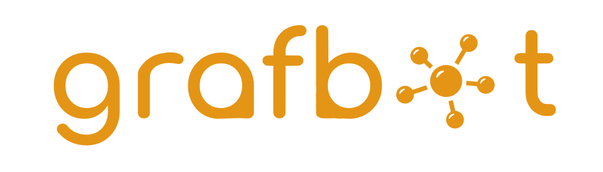

  
  
  
  

# Bienvenue 👋

## Grafbot ?

Grafbot est une initiative étudiante de recherche Nantaise en traitement automatique du langage. L'idée qui se cache derrière ce projet est de pouvoir créer, imaginer, œuvrer ensemble à la réalisation d'un outil de manière complétement indépendante et participative.  

Plus concrètement, Grafbot est un outil de traitement du langage basé sur des structures de données à base de graphe. S'il est question de graphe c'est parce qu'il est question d'implémentation de stockage d'information sémantique. Pour être précis, Grafbot est une initiative de recherche cherchant à mesurer l'efficacité de systèmes "intelligents" conciliant des domaines comme les neurosciences, la psychologie cognitive, l'informatique (machine learning), etc.

Ici le projet repose sur les concepts de mémoire sémantique (la mémoire des faits) et de mémoire épisodique (la mémoire des souvenirs). 

## Comment contribuer ?

1) Regardez la liste des tâches à réaliser classées par catégorie de compétence (Informatique, Linguistique, Psychologie, etc)
2) Clonez le repo sur votre machine pour y apporter des modifications.

> git clone https://github.com/Torilen/Grafbot.git

3) Envoyez un mail à aniss.bentebib@etu.univ-nantes.fr pour demander à être collaborateur/collaboratrice du projet. Par défaut nous acceptons tout le monde souhaitant apporter au projet.
4) Une fois toutes les modifications apportées, revenez ici et cliquez sur le bouton "New Pull Request" pour envoyer vos modifications. Elles seront revues par des pairs et des modifications pourront vous être demandées.

## Fonctionnement

> git clone https://github.com/Torilen/Grafbot.git
>
> git clone https://github.com/facebookresearch/ParlAI.git
>
> conda install --force-reinstall -y -q --name grafbot -c conda-forge --file Grafbot/requirements.txt
>
> cd ParlAI
>
> python setup.py develop
>
> pip install transformers == 2.5.1

## Datasets
* [Cornell](https://www.cs.cornell.edu/~cristian/Cornell_Movie-Dialogs_Corpus.html) : Anglais, +220k conversations _(Génération de langage)_
* [Ubuntu Dialog Corups](https://github.com/rkadlec/ubuntu-ranking-dataset-creator) : Anglais, _(Génération de langage)_

* [Europeana Newspaper](https://github.com/EuropeanaNewspapers/ner-corpora) Anglais, Français... _(Named Entity Recognition)_
* [Liste de corpus](https://github.com/juand-r/entity-recognition-datasets) Multilingue _(Named Entity Recognition)_

## Références
* [Embedding models for episodic knowledge graphs](https://scholar.google.com/scholar_url?url=https://www.sciencedirect.com/science/article/pii/S1570826818300702&hl=fr&sa=T&oi=gsb&ct=res&cd=0&d=5238262037328151074&ei=35ylXuaYBNqIy9YP85eIwAc&scisig=AAGBfm2S2N0AQmRqbobunMAeoxWJA9VR4w) Y Ma, V Tresp, EA Daxberger - Journal of Web Semantics, 2019
* [Learning with Knowledge Graphs.](https://scholar.google.com/scholar_url?url=https://pdfs.semanticscholar.org/f390/56d8cd88d5114273f568a130b6b120b53d06.pdf&hl=fr&sa=T&oi=gsb-ggp&ct=res&cd=0&d=11993380627212960441&ei=Np2lXovKL5XGmAGEgb7YBw&scisig=AAGBfm0wy4yiGonYuUusi3uu-rU-HZNO1A) V Tresp, Y Ma, S Baier - NeSy, 2017
* [Learning knowledge graphs for question answering through conversational dialog](https://scholar.google.com/scholar_url?url=https://www.aclweb.org/anthology/N15-1086.pdf&hl=fr&sa=T&oi=gsb-ggp&ct=res&cd=0&d=15362143584041873561&ei=5pOmXrzMOoGzmAGyv6DwCw&scisig=AAGBfm17I3U4AWHpZw68Dz4iumMY-B3iQA) B Hixon, P Clark, H Hajishirzi - Proceedings of the 2015 Conference of the North …, 2015
* [KG-BERT: BERT for Knowledge Graph Completion](https://arxiv.org/pdf/1909.03193.pdf) Liang Yao, Chengsheng Mao, Yuan Luo